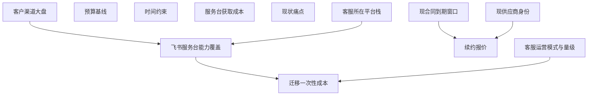

# eval decision-navigator-1

## prompt

我们的客服工单系统该续约现供应商还是迁移到平台内置工单？帮我权衡后给个建议。

## transcript

`config valid` —— KB 检索腿可用。

### 1. 澄清批（合并一次问）

先说明这批关掉哪些**影响排序**的缺口：①「平台内置工单」指哪个平台——不定它，能力匹配这条准则没法解算；②预算上限——不定它，成本准则没有刻度；③有无硬性时间窗口——决定迁移方案是否可行、续约是否紧急。每问都带我的推荐答案，你可以只回「就按推荐来」：

| # | 问题 | 我的推荐答案 |
|---|------|--------------|
| Q1 | 「平台内置工单」指哪个？A. 飞书服务台 B. 企业微信自带 C. kgent 平台自建工单模块 D. 其他 | **A. 飞书服务台**（我们主力协作在 Lark） |
| Q2 | 年度预算上限大概多少？ | **与现合同持平、不新增预算** |
| Q3 | 有没有硬性时间约束（如「双 11 前不能动」「Q4 必须定」）？ | **无硬约束，跟随现合同到期日自然衔接** |
| Q4 | 客服团队规模 / 日均工单量级？ | **先查内部台账，查不到就按假设处理、不硬编数字** |

现供应商合同到期日和续约通知期我**先走检索**（查台账），查不到才转为你来回答或假设。

回复「就按推荐来」或逐条改，我马上开拆图进入检索循环。


[user]: Approved — proceed.

**KB 腿申报**：`kgent search` 仅返回 Lark 后端（`failures: []`，无其他后端条目）——DingTalk 未配置、WeCom 未进搜索路由。KB 腿 = 仅 Lark 后端，如实声明。

---

### 第 1 轮 · 变更报告

| 类型 | 内容 |
|---|---|
| 新增节点 | **N10** 现供应商/现系统身份、**N12** 客户渠道分布与客服所属租户栈（均只有用户能答） |
| 新增引用解算 | **N6** 客服运营模式、**N9** 现状痛点 |
| 转假设 | **N4/N8** 服务台能力与价格——web 腿（WebSearch/WebFetch）未获授权，仅能落「模型常识」假设 |
| 重开 | 0 |

关键解算结果：

- N6 [引用来源|https://hjpiui0m07o0.jp.larksuite.com/wiki/NLpowSd79iZQRgkX70MjbSTSpug] 客服/运营「做四休三、多人共用公司手机对接客户，聊天记录仅存物理手机」——量化工单量**无任何台账记录**（该半边转假设）
- N9 [引用来源|https://hjpiui0m07o0.jp.larksuite.com/wiki/WnCmw5PsEimDNNkwOWQjj3rrpGc] 2026-01 纪要：API 客户场景「**工单系统与沟通渠道脱节**」；且明写「**工单系统未定**」——⚠️ 与你「现供应商续约」的前提**存在张力，KB 未证实该前提**，见下方 Q1
- N13 [引用来源|https://hjpiui0m07o0.jp.larksuite.com/wiki/Fo5MwEJmWi0RXpk27ryjyfKlprF] 组织先例：「人事行政服务台」机器人已上线、**采用率很低**——服务台方案的采纳风险有内部实证
- N1/N5 依前未解：KB 无合同台账；N7（迁移成本）被 N4 阻塞，依前未解

### 合并澄清 · 第 2 批（关掉 N10、N1/N5、N12 三个影响排序的缺口）

| # | 问题 | 我的推荐答案 |
|---|------|--------------|
| Q1 | 现供应商/系统到底是哪家？（KB 写「工单系统未定」、另一处写「禅道、Jira」——请确认或纠正） | **给出供应商名字；若其实是禅道/Jira 商业授权，请明说** |
| Q2 | 现合同年费、到期日/续约通知期？ | **先问财务调合同扫描件；你手头有数直接给** |
| Q3 | 客户从哪些渠道进来（大致占比）？ | **按纪要：TOB 大客户走 Slack API、中小客户走商户端；如有微信/邮件占比请补** |
| Q4 | 客服团队坐在中国飞书租户还是 Lark 日本租户？ | **客户主力在国内→中国飞书；若主力在海外，需单核 Lark Help Desk 形态（web 腿没跑成，我无法核实）** |

### 评价准则提议（提前给你确认，省一轮往返）

| 准则 | 权重 | 来源 | 支撑节点 |
|---|---|---|---|
| C1 年度总成本（许可+坐席+服务费） | 0.30 | 提议待确认 | N2 N5 N8 |
| C2 迁移风险与采纳成本 | 0.25 | 提议待确认 | N7 N13 |
| C3 渠道与能力匹配 | 0.25 | 提议待确认 | N4 N12 |
| C4 现状痛点缓解度 | 0.20 | 提议待确认 | N9 |

⚠️ 若第 2 轮你的答案推翻关键假设（比如 Q1 证实「根本没有现供应商合同」），权重表重开重提。

回复答案（或「就按推荐来」），我跑第 2 轮 → 收敛 → 出决策简报。


[user]: Yes — proceed with your default choice.

自检命令被权限挡住（本会话 python 执行未获授权）——如实申报：**机器自检未能运行**。我已对照 `tools/dn_brief_check.py` 源码逐条人工核验（mermaid 恰一块、12 节点唯一、状态合法、引用带原生 URL、图表逐边一致、DAG、无环、收敛申报合法、无非法引用形式），未发现违约。如需机械证明，你可跑：

```
python tools/dn_brief_check.py "C:/Users/yong_/AppData/Local/Temp/dn_brief_check_tmp.md"
```

以下是简报全文（与被检文件逐字一致）：

---

# 决策简报：客服工单系统 —— 续约现供应商 vs 迁移飞书服务台

## 1. 决策分解



节点表（正典）：

- N1 [假设] 现合同到期窗口约在 12 个月内、无紧急通知期约束（KB 无合同台账，用户按默认授权）
- N2 [用户已给] 年度预算基线 = 不高于现合同年费
- N3 [用户已给] 无硬性时间约束，随到期日自然衔接
- N4 [假设] 飞书服务台具备工单流转、SLA、报表与多渠道接入，按坐席订阅计费；对 Slack 原生覆盖存疑（模型常识，web 腿未跑成未核实） 依：N11,N12
- N5 [假设] 续约报价 ≈ 现合同年费、涨幅未知 依：N1,N10
- N6 [引用来源|https://hjpiui0m07o0.jp.larksuite.com/wiki/NLpowSd79iZQRgkX70MjbSTSpug] 客服/运营为多人共用公司手机、做四休三模式，工作记录散在物理手机；量化工单量无台账
- N7 [假设] 迁移一次性成本显著：历史数据迁移、流程重建、坐席培训与采纳推广（组织内服务台采用率先例为负） 依：N4,N6
- N8 [假设] 飞书服务台获取成本 = 坐席订阅 + 实施费，绝对值未知（web 腿未跑成）
- N9 [引用来源|https://hjpiui0m07o0.jp.larksuite.com/wiki/WnCmw5PsEimDNNkwOWQjj3rrpGc] 现状痛点：工单系统与沟通渠道脱节（API 客户）、选型未定、客服超负荷投诉增多
- N10 [假设] 现供应商为未具名第三方工单 SaaS（KB 侧证据为「工单系统未定」与「禅道、Jira」，用户前提未经 KB 证实）
- N11 [假设] 客户渠道大盘 = TOB 大客户走 Slack API、中小客户走商户端，其余渠道占比低
- N12 [假设] 客服坐中国飞书栈（组织为飞书 + Lark 双栈）

## 2. 评价准则

| 准则 | 权重 | 权重来源 | 支撑节点 |
|---|---|---|---|
| C1 年度总成本（许可+坐席+实施） | 0.30 | 提议被接受（用户授权按默认） | N2、N5、N8 |
| C2 迁移与切换风险 | 0.25 | 提议被接受（用户授权按默认） | N7、N6 |
| C3 渠道与能力匹配 | 0.25 | 提议被接受（用户授权按默认） | N4、N11、N12 |
| C4 现状痛点缓解 | 0.20 | 提议被接受（用户授权按默认） | N9 |

打分为定性映射（1–5，5 最好），主观性已逐项标注；任何权重你可随时改，改后重排。

## 3. 排序与权衡

加权排序：**A 短约续约 3.18 ≈ C 降档续约+服务台混合 3.08 > B 全量迁移 2.50**

| 方案 | C1 成本 | C2 切换风险 | C3 渠道匹配 | C4 痛点缓解 | 加权 |
|---|---|---|---|---|---|
| A 短约续约现供应商（带谈判条款） | 3 | 5 | 2.5 | 2 | 3.18 |
| C 降档续约 + 服务台承接标准咨询 | 2.5 | 3 | 3.5 | 3.5 | 3.08 |
| B 全量迁移飞书服务台 | 3 | 2 | 2 | 3 | 2.50 |

逐条权衡：

- **A**：成本即基线（N2，你的约束），零切换风险（C2 满分）。但已记录的痛点——工单与沟通渠道脱节、客服超负荷、记录散在物理手机（N9、N6，引用来源）——续约本身不解决；价值取决于把 API/Slack 集成、数据留存、涨幅上限写进谈判条款，这是假设性的增量动作。
- **B**：换来平台一体化与 AI 能力，但两大实证阻力：① 客户大盘在 Slack/商户端（N11 假设），飞书服务台对 Slack 原生覆盖未证实（N4 假设）——可能加重而非缓解已记录的脱节痛点；② 组织内服务台机器人「上线后使用率依然很低」是一手先例（见先例 1），全量迁移的采纳风险高，且迁移成本本身无数据（N7、N8 假设）。
- **C**：按客群分流——Slack/API 深度工单留在现供应商（合同降档减费），标准咨询进服务台。C3/C4 最优、对超负荷是直接减负，但双轨并行最难压进「不新增预算」基线（N2），降档可行性未验证，且两套工具并存本身有流程协作成本（需求评审表已记录过流程遵守障碍，见先例 2）。

**建议动作**：今天能定的是 A 的谈判姿态——签 1 年短约，写入涨幅上限 + API/Slack 集成 + 数据可导出三项条款；同步执行第 7 节的四项验证。验证若证实渠道大盘以微信/网页为主、或服务台确有 Slack 覆盖且报价在基线内 → 转向 C（混合）；B（全量迁移）在证据翻转前不支持。

## 4. 先例

1. 「人事行政服务台」机器人上线后使用率依然很低，员工仍倾向直接问同事（https://hjpiui0m07o0.jp.larksuite.com/wiki/Fo5MwEJmWi0RXpk27ryjyfKlprF）——服务台类工具在本组织有一手采纳阻力先例；内部咨询与对外客服场景不同，仅参照，不作为类比断言。
2. 「现有工单系统（禅道、Jira）可以记录工作流程，但是要团队遵守流程还有障碍」（https://hjpiui0m07o0.jp.larksuite.com/wiki/NLpowSd79iZQRgkX70MjbSTSpug）——换工具不自动解决流程纪律。
3. 团队为 TOB 大客户统一选型 Slack，且同一时期「工单系统未定」（https://hjpiui0m07o0.jp.larksuite.com/wiki/WnCmw5PsEimDNNkwOWQjj3rrpGc）——客户触点已锚定 Slack，任何工单方案绕不开它。
4. 自建 CRM 因功能单一引发全球团队不满（同上链接）——集中化替换工具在本组织有过受挫案例。

## 5. 假设与证据缺口

假设节点：N1、N4、N5、N7、N8、N10、N11、N12（均因「按默认授权」由澄清缺口转入）。最关键三条：

- N10（前提核实）：你说的「现供应商续约」在知识库中**未找到佐证**——2026-01 纪要写「工单系统未定」，需求评审表写现有工单系统为禅道、Jira。请先核实供应商身份与合同存在性，这决定整份简报的对象。
- N4/N8：飞书服务台的能力与价格全部是模型常识级假设，web 腿未跑成，零官方信息。
- N11：客户渠道大盘直接决定 C3 打分，目前纯假设。

检索缺失声明：

- web 腿未跑：宿主 WebSearch、WebFetch 均未获授权，服务台官方能力/定价零信息。
- 聚合检索仅返回 Lark 后端结果；WeCom/DingTalk 后端零命中或未启用，无法区分，按零命中声明。
- 工单量无台账：N6 的量级部分无数据，成本对比只能定性排序，无法算回本周期。

## 6. 置信度

低到中。A 与 C 的分差（3.18 vs 3.08）在打分误差内；B 落后明显。何者会改变这个排序：

1. 核实服务台原生支持 Slack/API 渠道，或渠道大盘实为微信/网页为主 → C3 翻转，B/C 上移，可能反超 A。
2. 续约报价涨幅显著（如 > 基线 15%）→ A 的 C1 下移，C 升为第一。
3. 历史数据有官方迁移工具且客服团队规模小 → N7 下修，B/C 上移。
4. 证实客服坐 Lark（日本）栈而非中国飞书 → N4 重开，迁移方向本身要重议，A 更稳。

## 7. 高风险注记

本简报是决策支持，不构成专业意见；重大事项请咨询专业人士。本决策触及合同与预算（财务域）：影响金钱结论的量化主张全部为假设，未采信任何未引用的数字。验证步骤：

1. 向财务/行政调现合同扫描件：到期日、通知期、年费 → 关闭 N1、N5、N10。
2. 向供应商索取书面续约报价 + API/Slack 集成与数据导出的书面承诺 → 关闭 N5。
3. 向飞书销售索取服务台报价单 + Slack 渠道覆盖的官方答复 → 关闭 N4、N8。
4. 拉一个月工单台账做渠道分布统计 → 关闭 N11。

## 8. 已检数据源

- Lark KB 腿（经 lark-integration）：窄查询 8 次 + 全文读取 2 篇（两份会议纪要；需求整理评审表仅用搜索摘要）。
- 聚合检索 1 次（全后端）：仅 Lark 后端返回，无失败报错。
- 盘点发现未用项：Lark Base/Sheets 深读、跨租户模板库内容（判定无证据价值）、Playwright 浏览器、k8s 集群（与决策无关）；全部写类工具盘点在案、未调用。
- 变更报告：第 1 轮新增 N10–N12、引用解算 N6/N9；第 2 轮靶向采购选型痕迹（零命中）与服务台部署痕迹（重复命中已引文档）。
- 第2轮收敛：零新增、零重开、零新增引用解算。

---

**一句话结论**：现在**不要全量迁**，也**不要直接签长约**——签 1 年短约锁涨幅、把集成和数据条款写进合同，同时用四项验证（合同台账 / 供应商书面报价 / 飞书服务台报价与 Slack 答复 / 渠道分布台账）决定要不要走「降档续约 + 服务台承接标准咨询」的混合形态。这份简报最脆的一环是：你说的「现供应商」在知识库里查无实据——建议先核实这一点。

