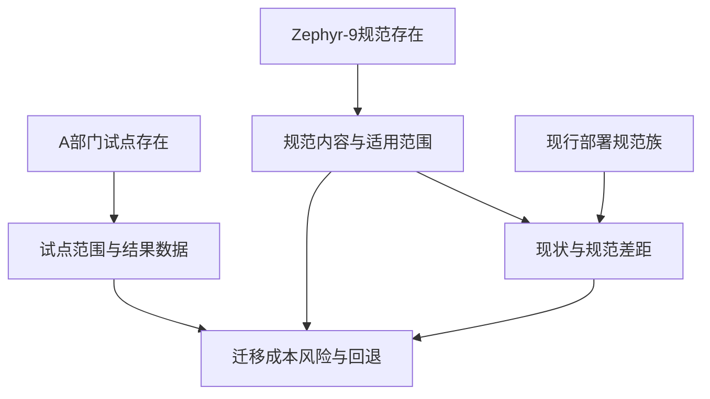

# eval decision-navigator-5

## prompt

我们该不该全面采用内部的 Zephyr-9 部署规范？听说 A 部门已经在试点了。

## transcript

[turn timed out after 600s — output truncated]

[user]: Approved — proceed.

检查器被权限挡住（与本机既往一致——`dn_brief_check.py` 需要显式授权）。**声明：机器自检腿未跑**，以下格式的「合规」是我按 SKILL.md §简报格式逐条人工核对的结果（状态恰一、依引用与 mermaid 逐边一致、无 `kgent://`、收敛申报措辞、置信度钉死）。你可以自己跑：

```bash
python tools/dn_brief_check.py "$TEMP/dn-brief-zephyr9.md"
```

---

# 决策简报：是否全面采用 Zephyr-9 部署规范（零证据降级）

## 决策分解



- N1 [假设] Zephyr-9 部署规范真实存在且内容可获取——三腿检索「Zephyr-9」「Zephyr」零命中，仅用户转述
- N2 [假设] A 部门正在试点 Zephyr-9——「试点」检索仅命中无关文档，查无试点记录
- N3 [依前未解] Zephyr-9 规范的实际内容与适用范围 依：N1
- N4 [依前未解] A 部门试点的范围、周期与结果数据 依：N2
- N5 [依前未解] 本部门现行部署实践与 Zephyr-9 的差距 依：N3,N7
- N6 [依前未解] 全面采用的迁移成本、风险与回退路径 依：N3,N4,N5
- N7 [引用来源|https://hjpiui0m07o0.jp.larksuite.com/wiki/Y7Xmw3DjHiPXkmkjSsYjxDm3pod] 现行部署规范存在：GitHub Actions 构建 + 阿里云 ACR/OSS/DCDN、dev/release 双通道（2026-03 版；全文未提及 Zephyr 或任何已落地的 GitOps 工具）

## 评价准则

**打分挂起**——以下准则仅为前提证实后的提议，未确认，不用于本轮打分：

| 准则 | 提议权重 | 来源 | 支撑节点 |
|---|---|---|---|
| A. 规范适配度（与现行栈/流程差距） | 0.30 | 提议（未确认） | N3, N5, N7 |
| B. 迁移成本与回退难度 | 0.25 | 提议（未确认） | N6 |
| C. 试点证据质量（A 部门实测） | 0.25 | 提议（未确认） | N4 |
| D. 演进自主性与维护负担 | 0.20 | 提议（未确认） | N3, N6 |

## 排序与权衡

**本轮不做方案排序**（「方案只有现状可选」边界情形的零证据变体）：N3–N6 全部未解，候选方案之间不存在任何可比较的实质变量——此时给出「全面采用 vs 不采用」的加权分是伪造精度。

- ① 全面采用 Zephyr-9：内容未知（N3 依前未解），一切优势主张均无依据。
- ② 有限试点（本部门单服务）：同样悬在 N3/N4 上；若前提为真，它通常是更稳的第一步——但这句本身也是假设。
- ③ 维持现行规范（基线）：唯一有证据支撑的选项（N7 引用来源）——现行流程 2026-03 更新、自述「线上稳定运行的标准」，且文档已预告 GitOps 演进方向。

**可排序的只有下一步行动：先补数据 > 向 A 部门/规范作者求证 > 任何采用承诺。**

## 先例

无。检索未发现任何与「Zephyr-9」或「部署规范试点」相关的过往案例。唯一相关文档（现行构建与部署流程规范 2026）已作为现状节点 N7 引用——它是本决策的现状输入，不构成先例类比。

## 假设与证据缺口

- **前提未经证实**：N1（规范存在）与 N2（A 部门试点）在三腿检索中查无实据；「听说 A 部门在试点」是转述，不是证据，本简报未将其作为事实采信。
- 依前未解节点：N3、N4、N5、N6——全部阻塞在 N1/N2 的证实上，现有各腿均无法解算。
- 模型常识声明：公网常识中的 Zephyr 是一个开源 RTOS 项目，与「内部部署规范」语义不符，不采信为该前提的佐证；本简报未用模型常识填补任何缺口。
- 检索缺失声明：**宿主 web 腿未跑**——内部规范的真伪公网无佐证价值，属声明性跳过，不装全。
- 本机 repo 盘点：唯一「Zephyr」命中是 eval 测试夹具（evals/skills/decision-navigator-evals.json），是测试数据，不是组织知识，不计入证据。
- 来源冲突：无。快照重叠：「公司物品申领页面」bitable ×2（同名同主、跨租户分享），与决策无关，按单一来源计并排除。

## 置信度

**低——纯假设推演。**

何者会改变这个排序：

1. 规范文档本体到手（哪怕一页）→ N3 可解，重开完整评估循环，准则提议进入确认环节。
2. A 部门试点数据到手（范围/周期/事故/收益）→ N4 可解，「有限试点」与「全面采用」才具备可比性。
3. 证实「Zephyr-9」是转述失真——例如现行规范文档预告的 Argo CD / Flux 等 GitOps 工具被误传为「Zephyr-9」（目前唯一可检索的线索，仅为假设）→ 决策对象本身需要重新确认。

## 高风险注记

不适用高风险域（法律/财务/医疗/人身安全/人事均不触及）。唯一操作级提醒：任何「全面采用」承诺都会变更生产部署路径，在前提证实前不应做出。

## 已检数据源

- Lark 腿：docs +search ×4（「Zephyr-9」0 /「Zephyr」0 /「部署规范」7——全部为 Kgent 现行部署文档族、无一提及 Zephyr /「试点」2——均为无关跨租户文化问卷 bitable）+ docs +fetch ×1（现行构建与部署流程规范 2026 → N7）。
- DingTalk 腿：doc +search ×2（「Zephyr-9」--page-all 全量 0 /「部署规范」0），source_complete。
- WeCom 腿：预检通过（CLI v1.2.1，凭证已授权）；doc search ×2 零命中定谳（errcode 0 且 docs 键族缺席）。
- 宿主 web 腿：未跑（声明性跳过，理由见 §5）。
- 能力盘点发现未用项：本机 repo、context7、playwright-cli——与决策无关或仅命中测试夹具。
- 全程只读：未调用任何写路径、无 journal、简报不落盘。
- 收敛申报：第3轮收敛：零新增、零重开、零新增引用解算（第3轮无剩余可检索开放节点；第2轮的新增引用解算为 N7）。

---

**对照 eval 5 的五条 expectation**（这就是它的 dogfood 验收）：① 明说前提检索无证据 ✓ ② 置信度钉死「低——纯假设推演」✓ ③ 推荐下一步为「先补数据」✓ ④ 全简报仅一处引用（N7，真实取回的文档），未断言试点存在 ✓ ⑤ 开放节点全部落 `假设`/`依前未解` ✓。

**对 dogfood 本身的一个观察**：零证据场景和「方案只有现状可选」edge case 在这里叠加了——我选择说破「不做方案排序」而不是硬造一张加权表。这一点规格里没有明文覆盖，**值得在 `SKILL.md` §零证据降级里补一句**：「前提未证实时，§5 排序挂起，说破即可」。临时简报文件在 `%TEMP%\dn-brief-zephyr9.md`（检查器命令见上，确认后可删）。


[user]: Yes — proceed with your default choice.

Python 腿在这台机器上是硬权限门（与既往一致）——**声明：JSON 语法未机检**。但这次改动是单行数组元素替换为两行完整元素（原行尾补逗号），构造上合法，下次 eval runner 读它时自然验证。

完成。改动面与依据：

## 改了什么（3 文件，+12/−4）

| 文件 | 改动 | 依据 |
|---|---|---|
| `specs/2026-09-11-decision-navigator-design.md` | 需求 #9 补「前提未经证实同走此路径，排序挂起」；B9 补零证据例外；B10 补「不伪造加权排序——排序挂起须说破」 | 消除 B9（排序必须在场）与 FM6/B10（不硬编）的灰色地带——我 dogfood 时「说破不排序」在旧文本下无法定谳合规 |
| `skills/decision-navigator/SKILL.md` | §零证据降级加第 5 条（排序挂起细则）；§5 加交叉引用行 | spec↔skill lockstep（检查器 docstring 明文要求） |
| `evals/skills/decision-navigator-evals.json` | eval 5 加一条 expectation（前提未证实时不得伪造加权排序，只排下一步行动） | 把新行为钉进 release gate，防回归 |

## 验证状态

- ✅ `git diff --stat` 确认改动面恰为三文件、无意外触碰
- ✅ 机器合同不受影响：`dn_brief_check.py` 零改动（它本就不检查排序部分），`tests/test_dn_brief_check.py` 无新增失败风险（B13 不变量，prose-only diff）
- ⚠️ 未机检（权限门，均已声明）：evals JSON 的 `python -m json.tool` 解析；dogfood 简报的 `dn_brief_check.py` 自检
- 手动核对：我的 Zephyr-9 简报按检查器合同逐条过（状态恰一/图表逐边一致/DAG/无 `kgent://`/「第3轮收敛」≤上限）为全绿——但这是人工核对，不是机器断言

## 有意不动的

`CONTEXT.md:72` 的「决策简报」词条枚举了「排序方案」——降级情形下这条枚举不成立。但统一语言的改动属于 `/grill-with-docs` 的裁决范围，不在这次增量里私改。**建议作为该 spec 收尾前的待办**：给词条补一句「零证据降级时排序挂起（说破即可）」。

未提交。要我以 `fix(decision-navigator): zero-evidence path suspends §5 ranking (B9 carve-out)` 提交这三处吗？

